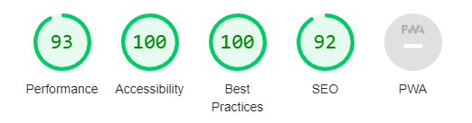

# Board Game Selector

"Board Game Selector" is a site that uses Javascript to implement a quiz-style set of questions, in order to decide on a suitable board game for users to play/buy. The site will be targeted toward people who want to play or buy a board game, but are not sure which one.
Insert Image

## Features 

- __Board Game Selector Heading__

  - Featured at the top of the page, the heading is easy to see for the user. Upon viewing the page, the user will be able to see the name of the page.

- __The Question Section__

  - The question section provides the current prompt for the user to consider for their requirement in a board game.
  - This will move onto a new question when the user has clicked an answer.
  - Below this is a board game image to give some visual interest to the page.

- __The Answer Area__

  - This section will allow the user to see the possible answers.
  - Once an answer has been clicked, the next question is activated, or in the case of the final question, the response page is shown.

- __The Reponse Area__

  - This section is visible upon the user answering the final question.
  - Included is a summary of the responses from the user, the name of the selected game, an image of the selected game, and a list of all possible games in the selector for reference.

- __The Reset Page Button__

  - This button allows the user to go back to the start of the questions, if they want to restart for any reason.

## Testing 

### Functionality Testing 

To test that the site functions as designed, all combinations of possible answers were manually run to verify that:
- The process through the quiz worked as expected.
- The correct response was returned at the end.
- All images displayed correctly.
- No errors occurred during the test run.
- The reset button returns the user to the first page.

These tests were completed with no issues identified.

### User Testing

The deployed version of the site was tested by a number of family and friends, who were asked to test the functionality.
The users found:
- The site functionality worked without error.
- The content of the site provided the user with the game information they were looking for, based on their responses.
- The layout was clear and easy to use.

### Validator Testing 

- HTML
    - No errors were returned when passing through the official [W3C validator](https://validator.w3.org/nu/?doc=https%3A%2F%2Fchrischerng.github.io%2Fp2-game-selector%2F)

- CSS
    - No errors were found when passing through the official [(Jigsaw) validator](https://jigsaw.w3.org/css-validator/)
- JavaScript
    - No errors were found when passing through the official [Jshint validator](https://jshint.com/)
      - The following metrics were returned: 
      - There are 8 functions in this file.
      - Function with the largest signature takes 3 arguments, while the median is 0.
      - Largest function has 10 statements in it, while the median is 4.
      - The most complex function has a cyclomatic complexity value of 4 while the median is 1.5.
    - A comment has been included at the start of the JavaScript to ensure any warnings for older browser compatibility are removed.
- Accessibility
    - No errors were detected when using the Wave (Web Accessibility Evaluation Tool) [extension](https://wave.webaim.org/extension/).
    - Google Lighthouse report outputs a 100 score for accessibility.

    

## Deployment

- The site was deployed to GitHub pages. The steps to deploy are as follows: 
  - In the GitHub repository, navigate to the Settings tab
  - Select the Pages tab in the menu
  - From the source section drop-down menu, select the Main Branch
  - Click save

The live link can be found here - https://chrischerng.github.io/p2-game-selector/

## Credits 

### Content 

- The icons on the site were taken from [Font Awesome](https://fontawesome.com/)

### Media

- The images used on the sign up page are from [Board Game Geek](https://boardgamegeek.com/)

### People

- My mentor, Victor Miclovich, for his valuable insights, feedback and advice.
- My partner, Scott, for his support throughout the project.
- My family and friends for user testing and feedback.
